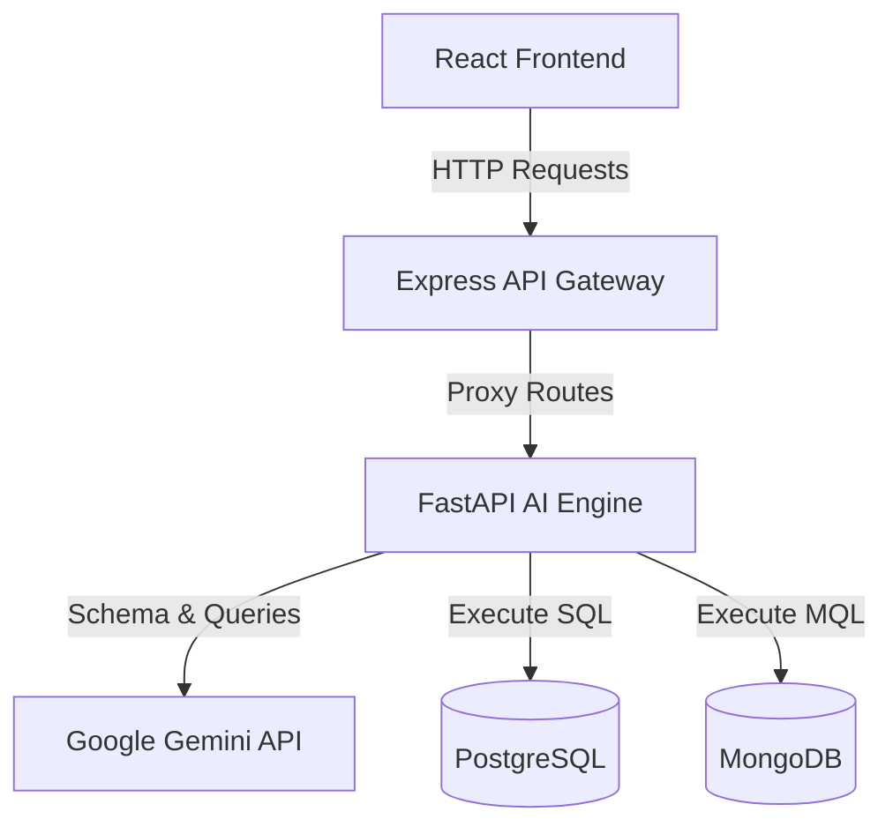
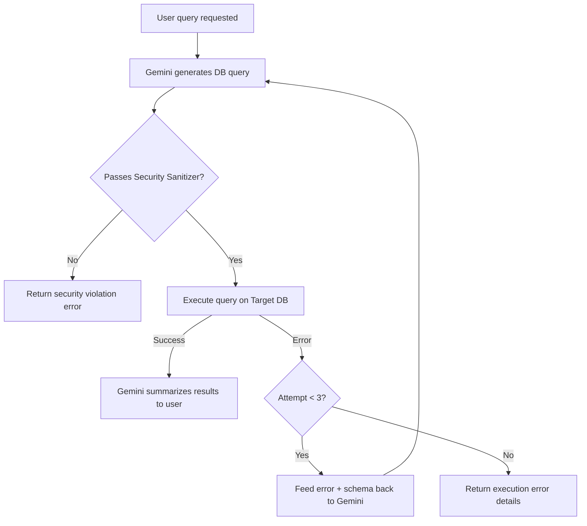

# TalkWithDatabase 🌐

A dynamic, intelligent database copilot application for **PostgreSQL** and **MongoDB**. Featuring schema introspection, strict read-only AST-based safety validation, and an automatic LLM-based query self-healing pipeline powered by the **Google Gemini API**.

---

## 🚀 Key Features

- 🔍 **Dynamic Database Introspection**: Automatically infers schemas, data types, column nullability, foreign key relations (PostgreSQL), and sample fields/values (MongoDB).
- 🛡️ **AST-Based Read-Only Safety Validation**: Protects against destructive actions. Validates that queries only perform read operations (e.g. `SELECT`, `find`, `aggregate`) and blocks any mutations or write stages (e.g. `INSERT`, `UPDATE`, `$out`, `$merge`).
- 🔄 **Self-Healing Query Pipeline**: If a generated query fails during execution, the exception and context are fed back to the Google Gemini API to dynamically generate a corrected query, attempting recovery up to 3 times.
- 💬 **Conversational Response Summarization**: Translates raw database records into clear, human-readable, and contextual answers.
- ⚡ **Modern Architecture**: Built with a React/Vite/Tailwind frontend, a Node.js/Express API Gateway with rate limiting, and a Python/FastAPI AI engine.

---

## 🏗️ System Architecture



---

## 📂 Repository Structure

```
├── ai-engine/             # Python FastAPI service for query generation & execution
│   ├── app/
│   │   ├── executor.py     # Executes SQL (psycopg2) and Mongo queries (pymongo)
│   │   ├── introspector.py # Introspects DB schema and relationship graphs
│   │   ├── main.py         # FastAPI app declaration & route handlers
│   │   ├── security.py     # Sanitizes and validates query read-only assertions
│   │   └── self_healer.py  # Self-healing loop & Gemini GenAI client wrapper
│   └── requirements.txt    # Python dependencies
│
├── backend-api/           # Node.js Express Gateway
│   ├── src/
│   │   ├── middleware/     # Auth & Rate Limiter middleware
│   │   ├── routes/         # Copilot proxy endpoints
│   │   └── server.js       # App initialization
│   └── package.json        # Node.js dependencies
│
└── frontend/              # React + Vite client SPA dashboard
    ├── src/
    │   ├── App.jsx         # Full dashboard interface
    │   ├── main.jsx        # App entry point
    │   └── index.css       # Tailwind directives
    └── package.json        # React app config & scripts
```

---

## 🛠️ Setup and Installation

### Prerequisites
- Node.js (v18+)
- Python (v3.10+)
- Google Gemini API Key

### 1. Configure the AI Engine (Python)

1. Navigate to the `ai-engine` folder:
   ```bash
   cd ai-engine
   ```
2. Create and activate a virtual environment:
   ```bash
   python -m venv venv
   # On Windows:
   venv\Scripts\activate
   # On macOS/Linux:
   source venv/bin/activate
   ```
3. Install the dependencies:
   ```bash
   pip install -r requirements.txt
   ```
4. Configure environment variables. Copy `.env.example` to `.env`:
   ```bash
   cp .env.example .env
   ```
5. Edit `.env` to include your Google Gemini API Key:
   ```env
   PORT=8000
   GEMINI_API_KEY=your_actual_gemini_api_key
   ```
6. Start the FastAPI server:
   ```bash
   uvicorn app.main:app --reload --port 8000
   ```

### 2. Configure the Backend Gateway (Node.js)

1. Navigate to the `backend-api` folder:
   ```bash
   cd ../backend-api
   ```
2. Install dependencies:
   ```bash
   npm install
   ```
3. Configure environment variables. Copy `.env.example` to `.env`:
   ```bash
   cp .env.example .env
   ```
4. Start the Express Gateway:
   ```bash
   npm run dev
   ```

### 3. Configure the Frontend (React / Vite)

1. Navigate to the `frontend` folder:
   ```bash
   cd ../frontend
   ```
2. Install dependencies:
   ```bash
   npm install
   ```
3. Start the React app in development mode:
   ```bash
   npm run dev
   ```

---

## 🛡️ Security & Read-Only Guardrails

To prevent malicious activity and accidental writes:
- **SQL Guardrails**: Uses regex-based AST sanitization to ensure statements start strictly with `SELECT`, `WITH`, `SHOW`, `DESCRIBE`, or `EXPLAIN`. It strictly blocks mutation words like `INSERT`, `UPDATE`, `DELETE`, `DROP`, `ALTER`, `TRUNCATE`, and administrative utilities.
- **MongoDB Guardrails**: Allows only read-only methods (`find`, `find_one`, `count_documents`, `distinct`, `aggregate`, `db_stats`). When executing aggregations, it strictly scans the pipeline JSON and blocks any pipeline containing `$out` or `$merge` write stages.

---

## 🔄 Self-Healing Query Execution Flowchart



---

## 🔌 API Endpoints Summary

The backend API gateway exposes the following endpoints (default port `5000`):

| Method | Endpoint | Description |
|---|---|---|
| `POST` | `/api/copilot/introspect` | Dynamic schema discovery & relationship analysis |
| `POST` | `/api/copilot/query` | Submits natural language queries for execution & summarization |
| `GET` | `/api/copilot/config/key/status` | Checks Gemini API key configuration status |
| `POST` | `/api/copilot/config/key/test` | Validates a temporary Gemini API key |
| `POST` | `/api/copilot/config/key` | Updates the backend's active Gemini API key |
